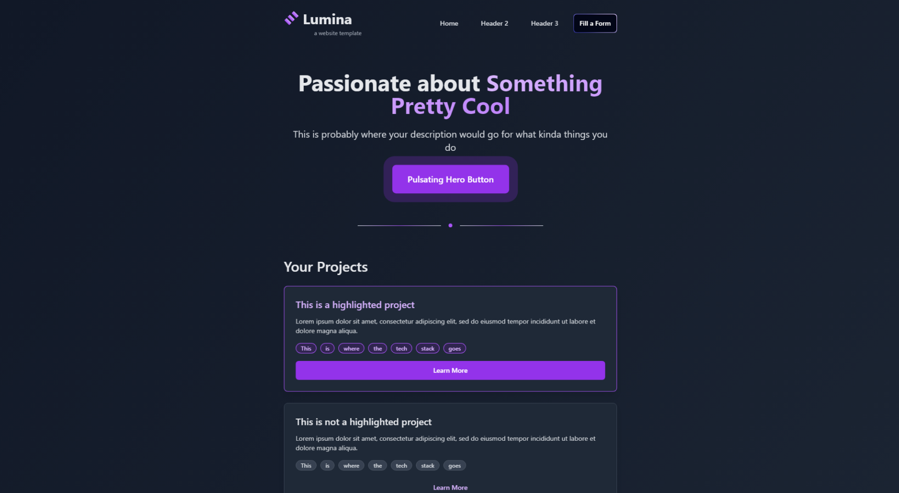

#  Lumina Website Template
Created by [@t-a-g-o](https://github.com/t-a-g-o)

> Lumina is a sleek, modern website template designed for developers and tech professionals to showcase their skills and projects. With its dark theme and vibrant accents, NeonStack offers a visually striking platform for your digital portfolio.
> View it live [_here_](https://tago.works).

## Table of Contents
* [Technologies Used](#technologies-used)
* [Features](#features)
* [Screenshots](#screenshots)
* [Setup](#setup)
* [License and Contact](#license-and-contact)

## Technologies Used
- Next.js
- Tailwind CSS
- JavaScript
- React
- Shadcn
- MagicUI

## Features
- **Responsive Design:** Looks great on desktop, tablet, and mobile devices
- **Dark Mode:** Easy on the eyes with a professional, modern aesthetic
- **Project Showcase:** Dedicated sections to highlight your best work
- **Tech Stack Display:** Visually represent your skills and technologies
- **Contact Form:** Simple and effective way to get in touch with you
- **Team Section:** Introduce yourself or your team members
- **Customizable:** Easy to modify and adapt to your personal brand


## Screenshots



## Setup
1. Clone the repository
    ```sh
    git clone https://github.com/t-a-g-o/lumina.git
    ```

2. Install requirements
    ```sh
    npm install -r
    ```

3. Run the live dev preview
    ```sh
    npm run dev
    ```
To make a favicon show in the browser, add an icon image to `src/app/`. It has to be "ico" format and it has to be named "favicon.ico".  Make the icon 256x256 if possible, this is the most visible and detailed icon in the browser.

## License and Contact
This project is published under the [MIT License](./LICENSE)

If you are interested in working together, or want to get in contact with me please email me at santiago@tago.works
